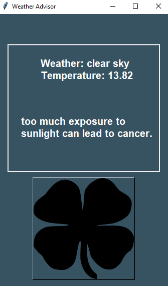

# Weather-Messenger
This project is a Weather Alert Generator in Python that sends personalized messages to clients with weather-specific precautions and recommendations. It utilizes the Pillow library to generate weather-specific images, and the Twilio API to send these images and messages as alerts to the clients.

  
   

## Features:

Weather Data Retrieval: The application uses weather APIs to fetch real-time weather data for different locations.

Image Generation (Pillow): Based on the weather data, personalized images are generated using the Pillow library. The images may include weather conditions, temperature, and recommended precautions for the specific location.

Personalized Weather Alerts: The generated images and custom messages are sent as weather alerts to individual clients.

Twilio Integration: The Twilio API is utilized to send SMS messages containing the personalized weather alerts to clients' mobile numbers.

Configurable Messages: The messages and recommendations can be easily customized to match the specific needs of clients and locations.

## Project Requirements:

Python 3.x
Pillow library for image generation
Twilio library for sending SMS alerts
API keys for weather data and Twilio (insert your API keys in the appropriate places)

## Instructions for Use:

Make sure you have Python 3.x installed on your system.

Install the required libraries if you haven't already (e.g., pip install pillow twilio).

Obtain API keys for weather data and Twilio, and insert them in the appropriate places in the code.

Run the weather_alert_generator.py script.

The application will fetch weather data for different locations and generate personalized images and messages.

Using the Twilio API, the personalized weather alerts will be sent as SMS messages to individual clients.